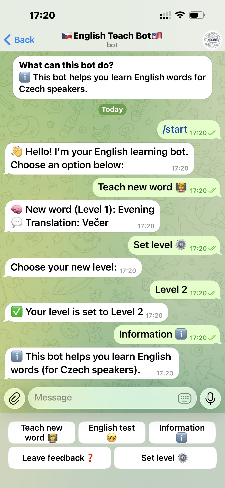
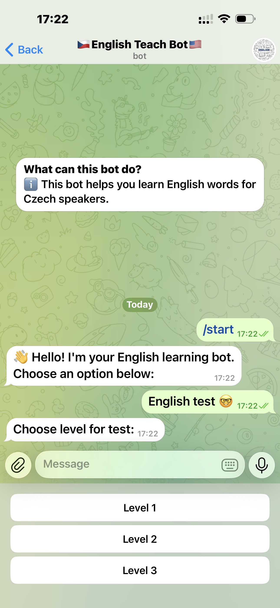
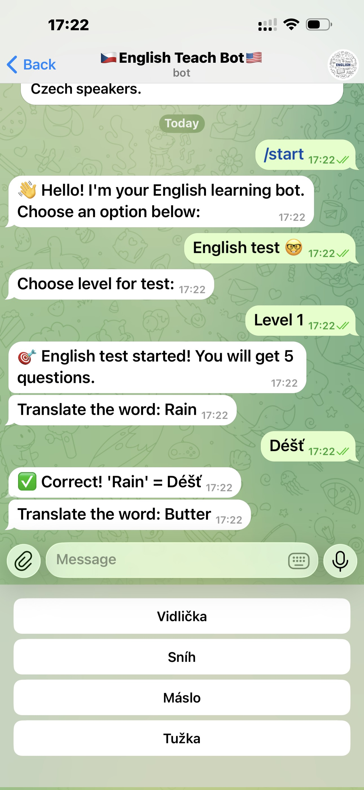
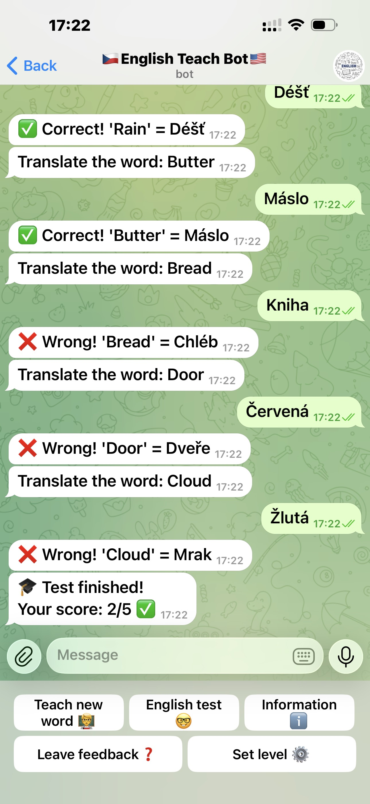

# <p align="center">TelegramBot_english</p>

<p align="center">A simple yet powerful Telegram bot for learning English through interactive word games and exercises.</p>

<p align="center">
  Created by <b>Eugene Zavirukha</b> · Powered by 
  <a href="https://core.telegram.org/bots/api">Telegram Bot API</a>
</p>

---

## 📘 About the Project

**TelegramBot_english** is an educational Telegram bot designed to help users improve their English vocabulary and grammar through fun and interactive features.  
Built with **Python** and **Telebot**, it’s an open-source project focused on accessibility, simplicity, and engagement.

---
## 🚀 Features

- 🧠 Random English word quizzes  
- 📚 Vocabulary practice with translation  
- ⏰ Scheduled daily learning reminders  
- 🗂️ Easy file-based word management  
- 🤖 Simple commands for user interaction

---

## 🛠️ Tech Stack

- **Language:** Python  
- **Libraries:** `telebot`, `dotenv`, `random`, `schedule`, `threading`  
- **Platform:** Telegram Bot API  

---
## 📸 Images
<p align="center">
  
  
  
  
</p>

---

## 📦 Installation

1. **Clone the repository**
   ```bash
   git clone https://github.com/jevhen123zavirukha/TelegramBot_english.git
   cd TelegramBot_english
